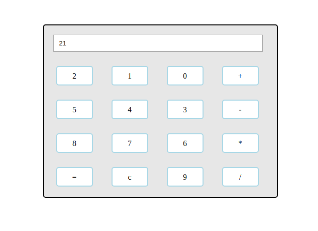

# Javascript-Calculator

Feature:
1.Support keyboard key bindings.

Keyboard:
1.Type 0 to 9 numbers;
2.Shift plus +: Will add the numbers;
3.Shift plus *: Will multiply the numbers;
4.-: Will subract the numbers;
5./: Will divide the numbers;
6.=: Will give the output;
7.backspace : Will clear the values;

Using npm package:
$ npm install javascript-calculator

This is simple Javascript Calculator

